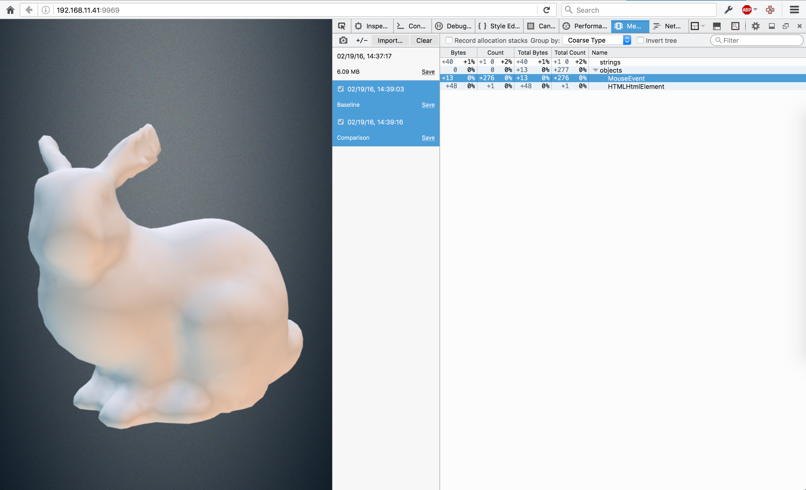

# Memory Leak Demo

Run `npm install` then `npm start` to start the demo.

# The leak

Record a memory snapshot, click and drag the bunny around, then run record
another. The diff will show the MouseEvent is leaking.

